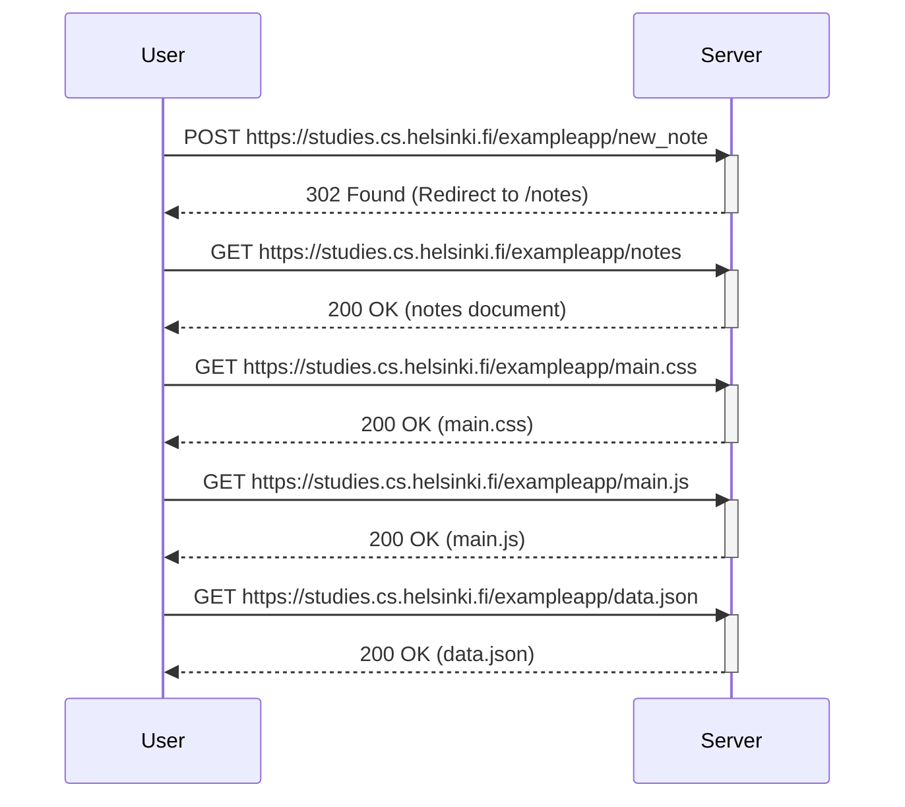

```mermaid
sequenceDiagram
    participant User
    participant Server

    User->>Server: POST https://studies.cs.helsinki.fi/exampleapp/new_note
    activate Server
    Server-->>User: 302 Found (Redirect to /notes)
    deactivate Server

    User->>Server: GET https://studies.cs.helsinki.fi/exampleapp/notes
    activate Server
    Server-->>User: 200 OK (notes document)
    deactivate Server

    User->>Server: GET https://studies.cs.helsinki.fi/exampleapp/main.css
    activate Server
    Server-->>User: 200 OK (main.css)
    deactivate Server

    User->>Server: GET https://studies.cs.helsinki.fi/exampleapp/main.js
    activate Server
    Server-->>User: 200 OK (main.js)
    deactivate Server

    User->>Server: GET https://studies.cs.helsinki.fi/exampleapp/data.json 
    activate Server
    Server-->>User: 200 OK (data.json)
    deactivate Server
```