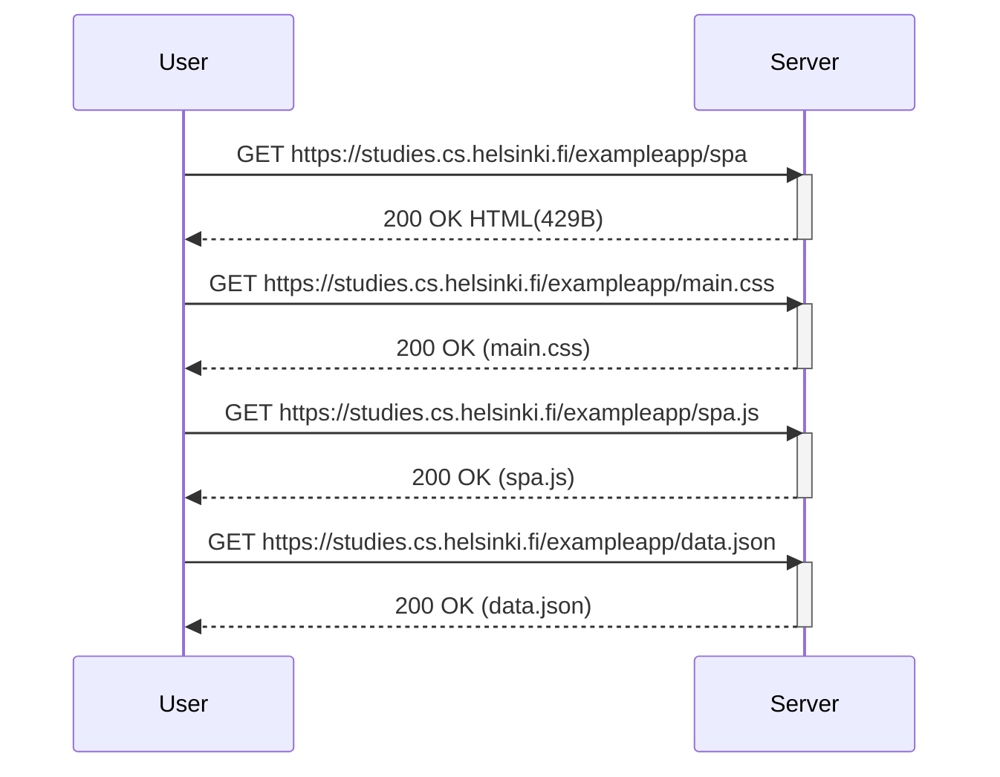

```mermaid
    sequenceDiagram
    participant User
    participant Server

    User->>Server: GET https://studies.cs.helsinki.fi/exampleapp/spa
    activate Server
    Server-->>User: 200 OK HTML(429B)
    deactivate Server

    User->>Server: GET https://studies.cs.helsinki.fi/exampleapp/main.css
    activate Server
    Server-->>User: 200 OK (main.css)
    deactivate Server

    User->>Server: GET https://studies.cs.helsinki.fi/exampleapp/spa.js
    activate Server
    Server-->>User: 200 OK (spa.js)
    deactivate Server

    User->>Server: GET https://studies.cs.helsinki.fi/exampleapp/data.json
    activate Server
    Server-->>User: 200 OK (data.json)
    deactivate Server
```